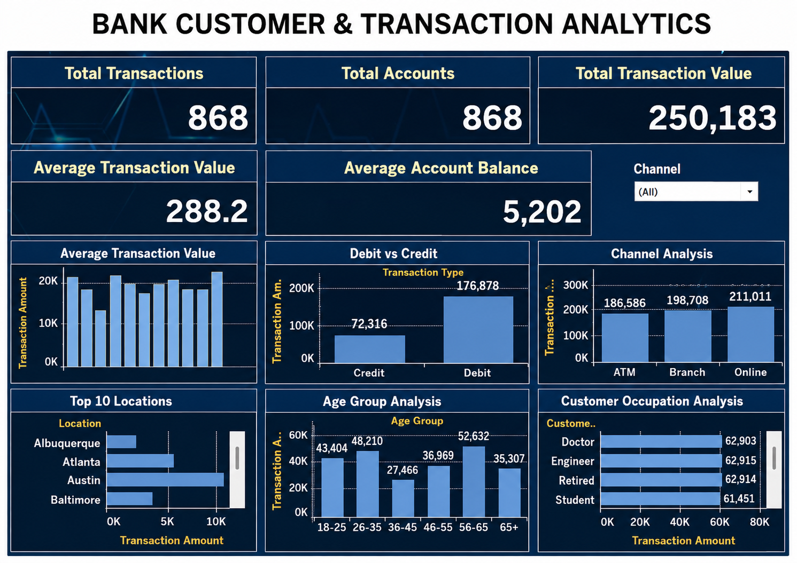

<div align="center">

# 🏦 Bank Customer Transaction Analytics

### End-to-End Data Analytics Project using Python, MySQL, Tableau & Power BI

This project transforms raw banking transaction data into meaningful business insights through data cleaning, SQL analysis, interactive dashboards, and business intelligence.

<br>


<br><br>



</div>

---

# 📖 Project Overview

The **Bank Customer Transaction Analytics** project demonstrates a complete end-to-end data analytics workflow. It begins with raw banking transaction data, which is cleaned and preprocessed using Python. The processed data is then stored in MySQL for SQL-based analysis and KPI calculations. Finally, interactive dashboards are created using Tableau and Power BI to visualize transaction patterns and customer behavior.

This project showcases practical skills in data preprocessing, database management, business intelligence, and dashboard development.

---

# 🎯 Project Objectives

- Clean and preprocess banking transaction data.
- Perform exploratory data analysis (EDA).
- Store data in a MySQL database.
- Develop SQL queries for business analysis.
- Create KPI metrics for performance monitoring.
- Design interactive Tableau dashboards.
- Build Power BI reports using DAX.
- Generate business insights for decision-making.

---

# 🚀 Project Workflow


```
Raw Dataset
      │
      ▼
Python Data Cleaning
      │
      ▼
Exploratory Data Analysis
      │
      ▼
MySQL Database
      │
      ▼
SQL Business Queries
      │
      ▼
KPI Calculation
      │
      ▼
Power BI Dashboard
      │
      ▼
Tableau Dashboard
      │
      ▼
Business Insights
```

---

# 🛠️ Technologies Used

| Category | Tools |
|----------|-------|
| Programming Language | Python |
| Data Processing | Pandas, NumPy |
| Visualization | Matplotlib, Seaborn |
| Database | MySQL |
| Dashboard | Tableau |
| Business Intelligence | Power BI |
| Development Environment | Jupyter Notebook |
| Version Control | Git & GitHub |

---

# 📊 Exploratory Data Analysis (EDA)

The dataset was analyzed using Python to understand customer transaction behavior and identify business patterns.

### EDA Activities

- Dataset inspection
- Missing value analysis
- Duplicate record removal
- Data type validation
- Transaction amount distribution
- Monthly transaction trend
- Debit vs Credit comparison
- Banking channel analysis
- Top transaction locations
- Customer age group analysis
- Customer occupation analysis

---

# 🗄 SQL Analysis

The project uses **MySQL** to store, validate, and analyze banking transaction data. A total of **22 SQL queries** were developed and organized into five modules.

### SQL Modules

#### 1. Database Setup (`01_database_setup.sql`)
- Create database
- Create tables
- Import dataset
- Verify database setup

#### 2. Data Validation (`02_data_validation.sql`)
- Check total records
- Validate NULL values
- Detect duplicate records
- Verify data quality

#### 3. KPI Queries (`03_kpi_queries.sql`)
- Total Transactions
- Total Accounts
- Total Transaction Value
- Average Transaction Value
- Average Account Balance

#### 4. Business Analysis (`04_business_analysis.sql`)
- Monthly Transaction Trend
- Debit vs Credit Analysis
- Channel Analysis
- Top 10 Locations
- Age Group Analysis
- Customer Occupation Analysis
- Top 10 Accounts
- Customer Spending Insights

#### 5. Project Completion (`05_project_completion.sql`)
- Final project summary
- Overall database validation

### SQL Skills Demonstrated

- Database Design
- Data Validation
- Aggregate Functions
- GROUP BY
- ORDER BY
- CASE Statements
- Date Functions
- Filtering
- Business KPI Calculation

---

# 📈 Key Performance Indicators (KPIs)

The dashboard includes the following KPIs:

- Total Transactions
- Total Accounts
- Total Transaction Value
- Average Transaction Value
- Average Account Balance

---

# 📊 Tableau Dashboard

The Tableau dashboard provides interactive visualizations for banking analytics.

### Dashboard Features

- KPI Cards
- Monthly Transaction Trend
- Debit vs Credit Analysis
- Channel Analysis
- Top 10 Locations
- Age Group Analysis
- Customer Occupation Analysis
- Interactive Filters

---

# 💡 Key Business Insights

- Debit transactions account for the highest transaction value.
- ATM and Branch are the most frequently used banking channels.
- Customers aged **18–35** contribute the highest transaction volume.
- Engineers and Doctors generate significant transaction values.
- A few locations contribute a major share of overall transactions.
- Monthly transaction trends reveal fluctuations in banking activity.

---

# 📂 Repository Structure

```text
Bank-Customer-Transaction-Analytics
│
├── data
│   ├── bank_transactions_cleaned.csv
│   └── account_summary_data.csv
│
├── notebooks
│   └── banking_analysis.ipynb
│
├── sql
│   ├── 01_database_setup.sql
│   ├── 02_data_validation.sql
│   ├── 03_kpi_queries.sql
│   ├── 04_business_analysis.sql
│   └── 05_project_completion.sql
│
├── Tableau
│   └── bank_customer_analytics_visualization.twb
│
├── PowerBI
│   └── Bank_Customer_Analytics.pbix
│
├── images
│   ├── tech_stack.png
│   ├── workflow.png
│   └── tableau_dashboard.png
│
└── README.md
```

---

# ▶️ Getting Started

### Clone the Repository

```bash
git clone https://github.com/SanthoshAnalytics/Bank-Customer-Transaction-Analytics.git
```

### Run Python Analysis

Open:

```
notebooks/banking_analysis.ipynb
```

### Execute SQL Scripts

Run the SQL files in the following order:

1. 01_database_setup.sql
2. 02_data_validation.sql
3. 03_kpi_queries.sql
4. 04_business_analysis.sql
5. 05_project_completion.sql

### Open Tableau Dashboard

```
Tableau/bank_customer_analytics_visualization.twb
```

### Open Power BI Dashboard

```
PowerBI/Bank_Customer_Analytics.pbix
```

---

# 🚀 Future Enhancements

- Real-time banking dashboard
- Fraud detection using Machine Learning
- Customer churn prediction
- Interactive Streamlit application
- Automated ETL pipeline

---

# 👨‍💻 Author

## Santhosh V

**Aspiring Data Analyst**

### Skills

- Python
- SQL
- Tableau
- Power BI
- Pandas
- NumPy
- Matplotlib
- Seaborn
- Data Visualization
- Business Intelligence

### GitHub

https://github.com/SanthoshAnalytics

---

<div align="center">

⭐ **If you found this project useful, please consider giving it a Star!**

</div>
